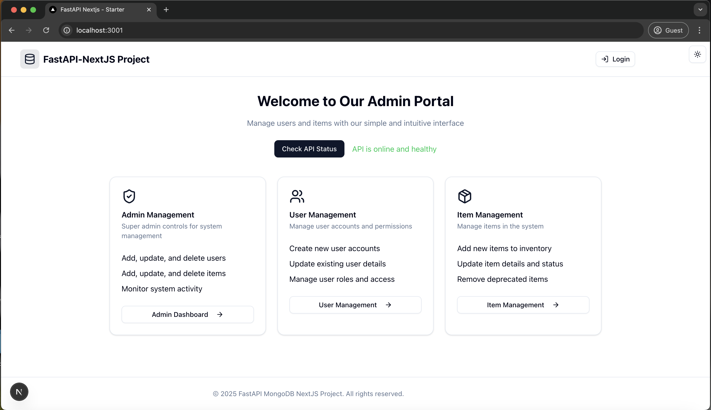
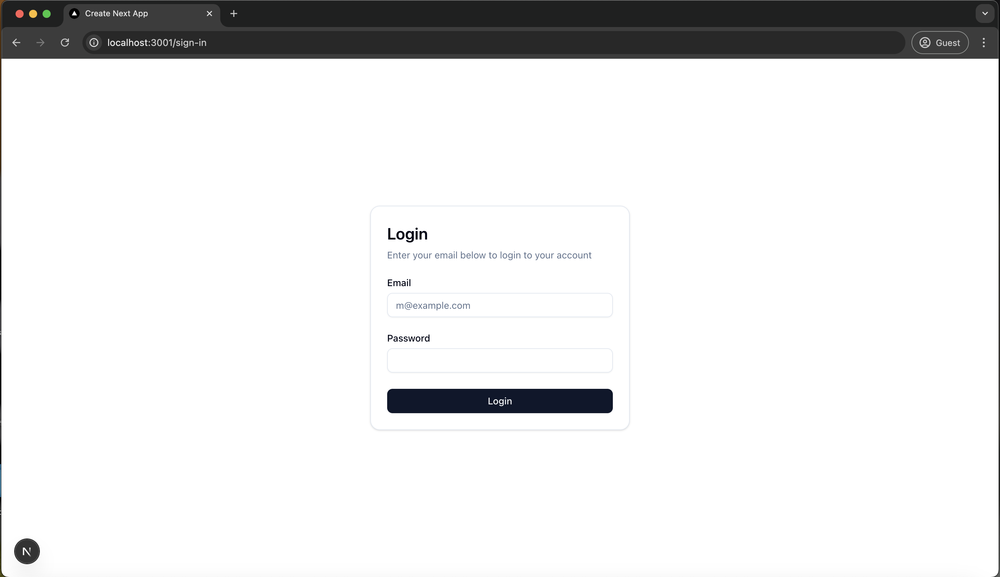
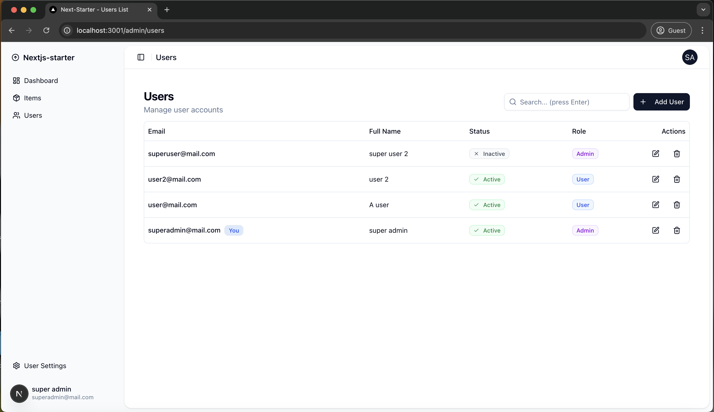
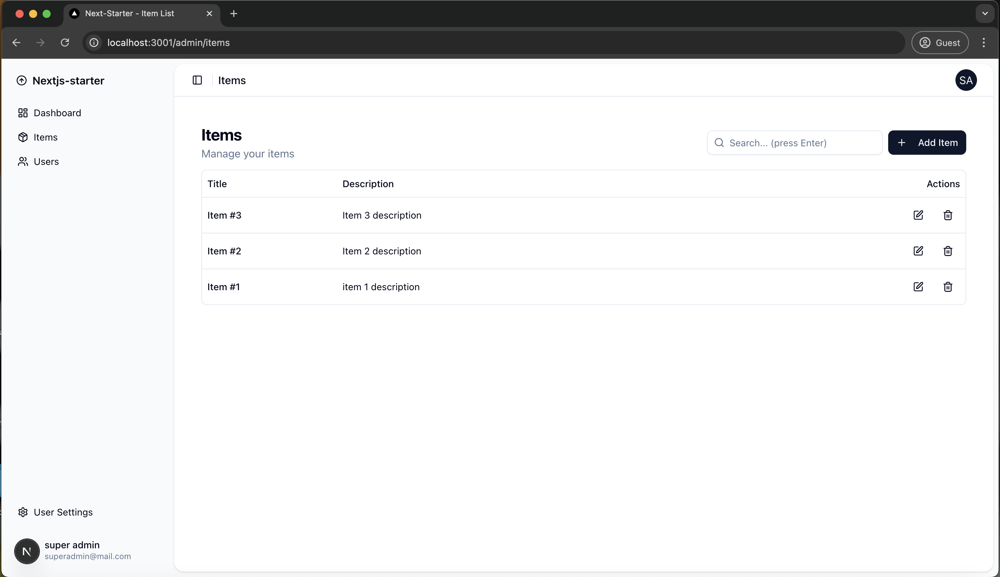
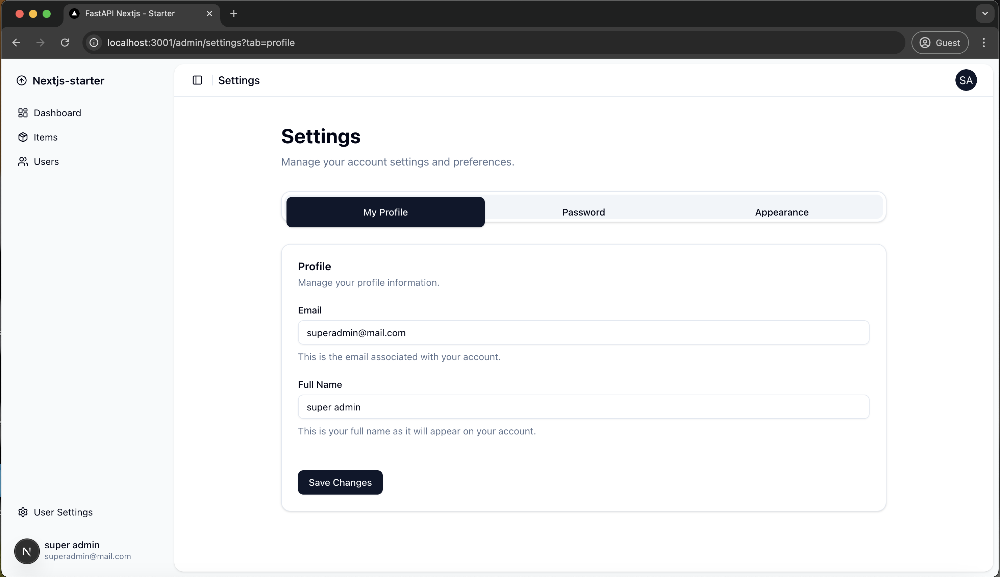
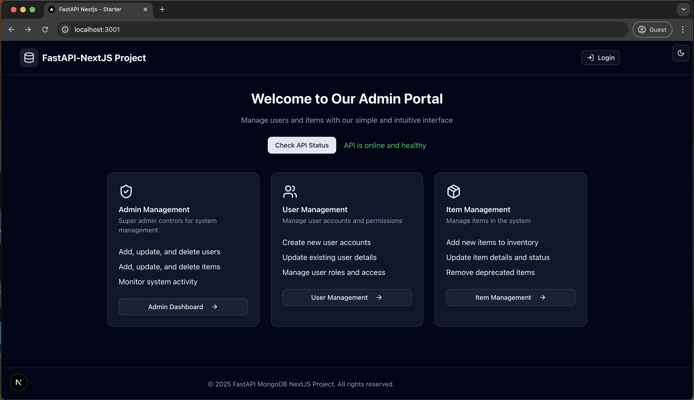
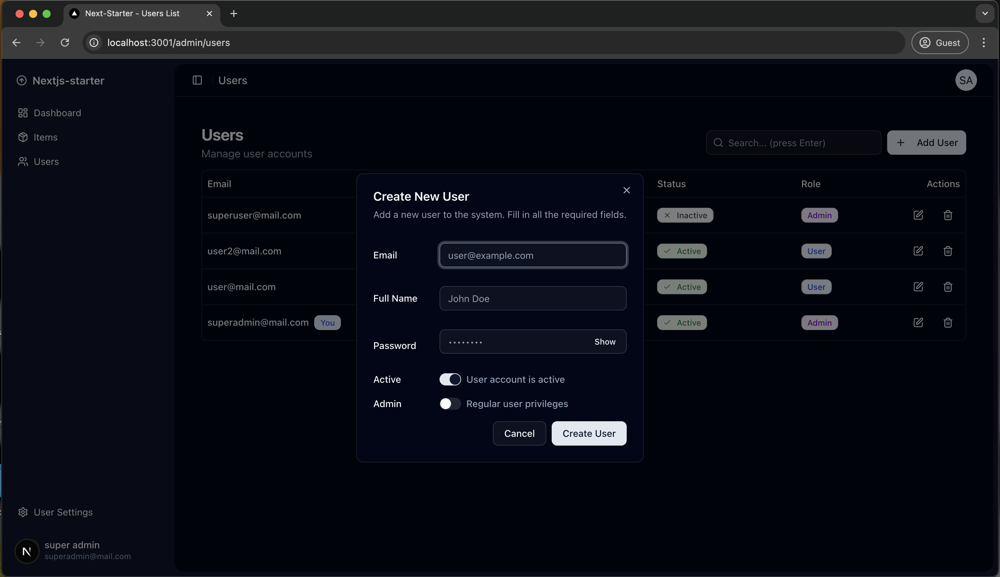

# MongoDB Full Stack FastAPI - Nextjs Template

## Technology Stack and Features

- ⚡ [**FastAPI**](https://fastapi.tiangolo.com) for the Python backend API.
  - 🔍 [Pydantic](https://docs.pydantic.dev), used by FastAPI, for the data validation and settings management.
  - 💾 [Pymongo ORM](https://github.com/drlsv91/pymongo-orm) as the MongoDB ORM.
- 🚀 [Nextjs](https://nextjs.org/) for the frontend.
  - 💃 Using TypeScript, shadcn, and other parts of a modern frontend stack.
  - 🎨 [Shadcn](https://ui.shadcn.com/) for the frontend components.
  - 🤖 An automatically generated frontend client.
  - 🦇 Dark mode support.
- 🐋 [Docker Compose](https://www.docker.com) for development and production.
- 🔒 Secure password hashing by default.
- 🔑 JWT (JSON Web Token) authentication.
- 📫 Email based password recovery.
- ✅ Tests with [Pytest](https://pytest.org).

## Screenshots

### Home Page

### Login Screen

### Dashboard - List Users

### Dashboard - List Items

### Dashboard - Settings

### Dark Mode

## How To Use It

You can **just fork or clone** this repository and use it as is.

✨ It just works. ✨

## Backend Development

Backend docs: [backend/README.md](./backend/README.md).

## Frontend Development

Frontend docs: [frontend/README.md](./frontend/README.md).
